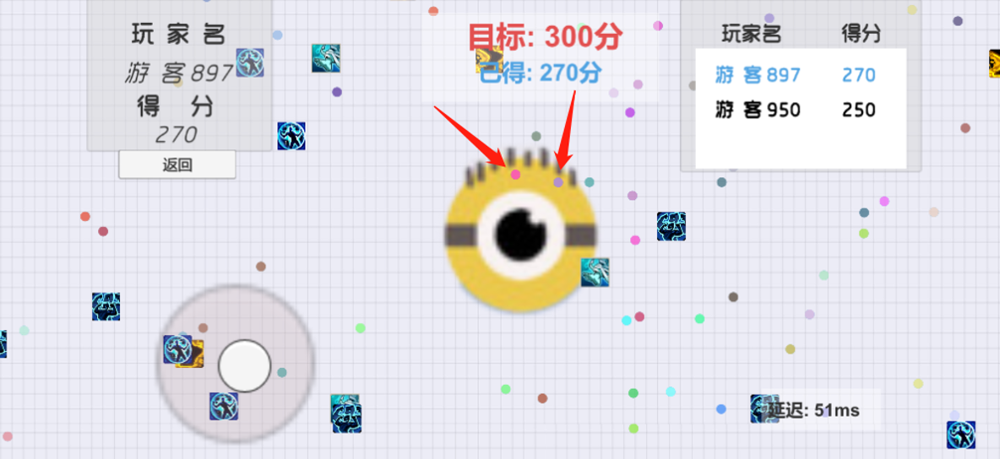

+++
draft = false
date = "2022-02-19T21:32:04+08:00"

title = "2021年终总结"
description = "2021 年年终总结"
author = "Philo"
authorlink = "https://twitter.com/zlc_milano"
show_toc = false
disable_mathjax = true
disable_highlight = true
+++

2021 年于我而言是平凡的一年。这一年新冠肆虐，omicron 后来居上，强势刷新全球各国新冠感染人数；这一年我从苏州来到了深圳，成为了腾讯微信支付的一名普通实习生；这一年，我体会到了手里有钱的快乐；也是这一年，我开始对人生有了更多的思索。

## 生活

2021 年第一天以伤春悲秋和卖菜开始，对比现在，发现吐槽并没有什么用，该单身还是单身，该菜还是菜。

2 月回家过年，略去不表。

3 月学校开学了，购入了一台 AOC U2790PC 显示器，不得不说，大屏幕的观感属实不错，可以极大提升工作学习效率。当时非常后悔没有早点入手，也非常后悔大学时候没有入手一台。可惜的是，后面来深圳实习的时候，顺丰把显示器屏幕给运坏了，当时收货时没有仔细检查，真的是后悔莫及。

3 月份还有一件事，就是开始找实习了，这个得好好讲讲。当时一心想要进大厂又担心进不去，所以在投简历的时候就非常的讲究层级关系，先从小公司开始投起，慢慢再开始投中厂，最后是大厂，争取多拿几个保底，毕竟手上有粮，心中不慌。于是开始在实习僧以及拉勾网海投。从收到的邮件来看，大致有这几家：
- 猿辅导
  
  猿辅导实习工资很高，初始投递时简历没过，后来找了内推，结果挂在了第一次算法笔试上，遂无。
- 趣头条
  
  通知 hc 满了。
- 卫瓴科技
  
  忘了这个是个啥公司了，投了之后一直没理我。
- 广州好智
  
  投了之后就没理我。
- 酷家乐
  
  其他公司我都投的是后端研发，这个公司我投的是容器开发。面试时凭借我微薄的容器知识，分分钟就被面试官面得哑口无言。最后还是给我发了 offer，但是最后也被我拒了。

  感觉这个公司很有意思。
- 好未来
  
  做教育的，貌似面试不是很难（记不太清了），最后给我发了 offer，然后我发邮件去说我不想去教育公司，想拒了 offer，hr 给我打电话说他们是科技公司，不是教育公司，让我再好好考虑一下（感觉 hr 小姐姐都气笑了）。当然我最后还是拒了。

  还好当时没去，7 月份政府发了个双减政策，整个教培行业一命呜呼。

- 小红书
  
  好像简历都没过。
- 七牛云
  
  七牛云来学院招了很多人，我怀疑我简历没过是因为太多兄弟把我挤没了。
- Cropto.com
  
  看名字就可以猜到是做区块链的，是一家深圳的外企。这个是我接到的第一个正式的 offer，并且也是整个实习面试过的公司中我最有好感的一个 offer。

  整个面试过程非常人性化，浓浓的外企风格，hr 小姐姐能够非常及时的跟进面试进度，并且也会给你传授很多的经验。面试官对我印象很不错，也很希望我过去。最后拒这个 offer 的时候，hr 小姐姐一番话都快给我感动哭了。

  总的来说，面试体验非常好，希望国内各大公司跟进。

- 声网
	
	去年语音社交平台 clubhouse 大火，据说其关键技术就是基于声网这家公司。

	整个公司感觉真的挺牛逼的，最后给我发了 offer，结果我还是拒绝了。
  

- 旷视科技

  知名人工智能公司，面试官也很想要我去，给我发了 offer，最后我还是拒绝了。

- 商汤科技
  
  知名 AI 独角兽，面试我的人还在香港做研究，招我去给他们搭建平台来着。给了 offer，最后让我拒了，因为觉得搭平台太没意思。
  
- 美团

	忘了投的是哪个部门了，几轮面试之后，快要给我发 offer 了，结果我当时已经拿到微信 offer 了，然后我就给流程中断了，记得面试官还给我打电话问中断原因，他也是非常希望我可以去的。

- 滴滴

	一面面试官非常有意思，估计是觉得面算法没啥意思，所以面试时候就把算法放到最后随便面一下。这个面试官亲自准备了一些 golang 的小 quiz，如果面试者没好好学习过 golang 的话，大多题应该都还答不上来，感觉面试官应该是真心喜欢 golang 这门语言的。我答得还不错，二面 leader 面随便问了一些问题，然后就给我过了。最后给我发了 offer，当时我已经有腾讯的 offer 了，虽然我很喜欢那个面试官，但是我考虑了一下，还是给拒绝了。

	结果后面滴滴被国家给整治了，只能说我运气好，避开了当年的很多坑...

- 字节跳动

	垃圾字节，天天给人打电话，面试时候面试官对我爱答不理的，整个面试过程让我非常不爽，一面就挂了。

	当然面试挂了主要还是我菜的原因，但是自此开始对字节跳动的印象就不好了。

- 阿里巴巴

	投的是阿里云，结果被做物流的组先面了。一面时候，面试官跟我说他们到底是做什么的以及怎么做的，说了好多好多，给我感觉不是面试到像是聊天，最后随便问了几个问题就给过了。

	后面我拿到腾讯 offer 了，然后就中断了流程，毕竟面了那么多家，心里也早倦了。面试官还给我打电话，让我再好好考虑下，再三考虑之后，我还是拒绝了。

- 腾讯

	腾讯是我正式拿的第二个 offer，拿到这个 offer 之后我就心满意足了，彻底躺平，其他的面试都是随缘面了。

	初始投的是 csig，二面算法面表现贼差，一度以为没了，结果又进行到了第三面。第三面面完之后给我发的是微信的 offer，才发现第二面原来是挂了的，只不过后面被我们组给捞起来了。

	腾讯的面试流程很专业，是所有实习面试公司中我观感第二号的公司（第一是外企 Crypto.com）。

其实应该还投了很多家，但是有的简历就像石沉大海，没有回响，最后有记录的也就这几家了。

4 月断断续续看完了五季《绝命毒师》，这真的是我目前看过最好看的美剧。老白最后一集说出"I do it for myself"真是让我看到飙泪。当 Baby Blue 响起的时候，《绝命毒师》已经成为我心目中最好的美剧了，没有之一。

6 月份主要是工程实践答辩，我和其他三位同学用纸糊了一个简版贪吃蛇，完成了工程实践答辩。只能说，做得贼烂。

7 月主要是在考试，这是我作为学生最后一次踏入考场了，自此之后，学校的考试应该与我再也无甚关系。

7 月份还有一件好笑的事是我以为一个女生对我有好感，结果我主动约她的时候却被残忍拒绝。

8 月初去深圳实习了，第一次实际体验到中国的房价之高，2500 租了一个 8 平米的小单间，对比于去年在杭州 2500 租的 25 平米，只能说深圳房价真的太贵了。走之前去上海玩了一次，体会到了什么叫做国际大都市，我可太喜欢上海了。

8 到 10 月其实并没有做出来多少东西，三个实习生合作做一个压测平台，结果三个月之后，另外两个跑路了，剩下的全被我接手了过来，并且按照自己的喜好重写了代码。11 月的时候平台已经可以上线使用了。

实习开始后，手头有了一点小钱，而房租已经被家里付过了，于是开始买一些自己以前一直想买的东西。初始入手了一个 Nintendo Switch。为什么买 switch 而不是 PS5 或者 Xbox 呢？其实主要是考虑到 switch 更适合多人/家庭场景，游戏嘛，还是要和别人一起玩才能更快乐。整个 8 月到 10 月，回家之后基本都是在打游戏，空闲时间基本交代给了塞尔达和哈迪斯。

10 月末，和同事驾车到深圳东西涌（chong，第一声）去看海和海滩，我真的很喜欢海天一色。

11 月入手了一个 AirPods 3，是去年我觉得体验最佳的电子产品。11 月我哥来广州工作了，所以我还去了一趟广州，感觉广州比深圳生活舒适很多。

这个月还收到了年轻人的第一个数字藏品。

12 月主要是在写代码，新平台上线后，mentor 不断提新的需求，因而大部分的时间都是在写需求。

1 月份无心干活，大部分时间都是在摸鱼和维护平台。临近放假时候请了个假，准备提前跑路回家，结果临走前自己发了个线上 bug，还被 mentor 训了一顿（捂脸）。

2 月份主要就是过年啦。又见到了一年没见的朋友们，和朋友去 KTV 的时候，还发现自己竟然是潜藏的麦霸。这次过年，我还凭自己的工资给家里添了好多东西，看到父母开心的样子，我也很满足。

PS，过年时候偶然发现了一款非常好吃的饼干，买来发现好吃之后，我还给我哥买了一份，在此强烈推荐给大家。

## 碎碎念

2021 年一共发了 4 条朋友圈动态（我真的不喜欢朋友圈），以及数不清的 Twitter（我是真的喜欢在 Twitter 上胡说），还有 40 条 flomo memo。

总的来说，我更喜欢在 Twitter 上发表自己的观点而不是朋友圈，毕竟 Twitter 如此自由，想说什么就说什么。

## 运动

这一年我运动了很多次，由于之前没有 Apple Watch，所以大部分的统计数据丢失了。8 月份之前，当时还在学校里，我主要是跑步，每次跑 5 km，差不多一周会跑2~3 次。主要使用手机 keep 记录，翻了一下，发现keep 只记录了寥寥几次。

8、9 和 10 月基本没怎么运动，11 月主要是在公司健身房的跑步机上跑步，12 月和 今年 1 月开始使用椭圆机，今年 2 月份为了更好的统计自己的运动数据，购入了 Apple Watch Series 7.

## 游戏和软件和硬件

这一年是我的付费元年，手里有了点钱之后，我开始购买一些付费的应用和电子设备以及给喜欢的网站/应用捐款。

硬件方面，这一年先手入手了：
- Nintendo Switch

	在 switch 上我先后购入了：
	- Hades
	- The Legend of Zelda: Breath of the Wild
	- Super Mario Odyssey
	- Overcook 2
	- Mark of the Ninja
	- Guns Gore and Cannoli。

	买游戏总计应该花了 1000 块左右了。只能说不愧是任天堂，买来之后我的闲暇时间基本都交给了塞尔达和哈迪斯。

- AirPods 3

	AirPods 3 的体验出乎意料的好，远远超出我的预期，这个是今年买的最值的硬件。后来我把我手头原价两千多的的 Bose  QuietComfort Earbuds 出了，回血了 1000 大洋（其实我觉得还挺亏的）。
- Apple Watch

  之所以买 Apple Watch，是为了方便记录自己的运动数据。在我看了一众手表的评测之后，其实我更喜欢 Samsung Galaxy Watch 以及 Pixel Watch，奈何这俩家伙实在跟 iPhone 不对付，只好买了 Apple Watch。

	目前的一个槽点就是，电池有点鸡肋，基本快要一天一充了。另外比价后悔的一点是，当初买的时候觉得小表盘应该就够了，所以买了 41 mm 的，结果买了之后发现还是稍微小了一点点，后悔当初没有加个 200 块钱买个 45 mm 的。不过既然已经拆封了，那就没办法了。

先后给 Wikipedia 捐了两次款，希望 Wikipedia 能够坚持下去。

软件方面，付费购买了以下软件：
- Bartender
  
  在 mac 上还是挺好用的任务栏图标管理软件。

- iStat Menu
  
  mac 性能数据可视化，非常好用。

- Little Snitch 4

  管理 mac 上的流氓软件联网的，也很不错。

- MindNode
  
  思维导图软件。买了之后发现其实我需要的是好好学学怎么做有效的笔记，而不是使用思维导图...

- Notability

  笔记软件，以前主要是在 iPad 上用，结果现在不怎么用 iPad 了...

- Notion

  笔记软甲，这个还是挺值的，现在我的笔记基本都是在 Notion 上记录。

- TG Pro
  
   mac 风扇管理，迫于 Mac Fan Controls 太贵了，所以买了这个，总体使用感觉还是不错。只能说 mac 性能和散热实在太差劲了。

- TickTick

	也就是滴答清单，我用它作为我的任务管理和 TODO 软件，总的来说还是很好用的，我很喜欢。现在基本每天都在用。

- Moze 
  
  记账软件。这个软件我也很喜欢，做得很精细，很干净，没有广告。基本也是每天都在用。

- HeartWatch: Heart Rate Moonitor
  
  搭配 Apple Watch 用的，主要用于心率监测。

- Google One
  
  订阅了 Google Drive 100 GB 的云盘，每月 2 美刀，还是觉得挺划算的。

- 1 Password
  
  密码太多了，实在记不过来，所以只好买了个密码管理软件，总的来说还挺不错。

## 音乐
过去一年听得最多的音乐软件是 Spotify，在 Spotify 上一共花了 6907 分钟，约等于 115 小时，不到 5 天。具体的一些数据由于没有记录下来，所以现在找不到了，现在我在[last.fm](https://www.last.fm/) 上记录自己的听歌数据，明年应该能有一些准确的数据。

这一年听的最多的 Podcast 是 故事 FM，差不多每一期我都听了。感受别人的生活确实是一件非常有趣的事情。

## 图书和电影（电视剧）

去年我开始在豆瓣上记录自己看过的书和电影电视剧。2021 年在豆瓣上一共有 75 条记录，其中 40 条关于影视的，35 条关于书籍的。

去年看过的好剧/电影有：
- 《性爱自修室第三季》
- 《Don't Look Up》
- 《Finch》
- 《绝命毒师（五季）》

《时光之轮》第一季拍的是在过于一般，《基地》第一季实在是个烂片。

去年又看了一遍《三体》全集，此外还看了五本《基地》，看了五本之后，后续的感觉已经没必要看了。

## 总结

总的来说，这一年也是平平淡淡，没有发生什么重大的事情。由于新冠肆虐，这一年基本没有出去玩。在一段实习之后，我的目标是 be more professional。

The best is yet to come.
